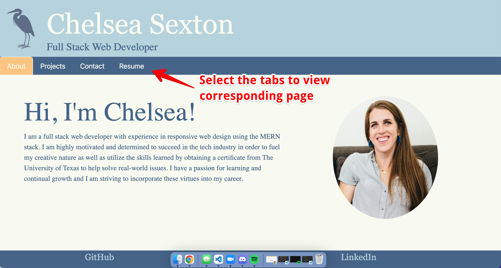

# **Portfolio**

## Deployed Site
Click [here.](https://chelsea314.github.io/portfolio/)

## Description
Welcome to my professional portfolio. Here you will be able to learn more about me, explore my most recent projects and contact me with any inquiries. 

## Table of Contents
 - [How it Works](#how-it-works)
 - [Resources](#resources)
 - [Contributing](#contributing)
 - [Questions](#questions)

## How it Works
View the About Me tab to learn more about who I am. You can also view my GitHub and LinkedIn portfolios by following the links in the footer. 

To view more, select the tab of the corresponding section you wish to explore.

On the projects page, you can view my most recent applications. Each application has a button to view the deployed site as well as the GitHub repository.

On the contact page, you can select the links on the left to contact me via email or phone. You can also view my LinkedIn and GitHub portfolios from this screen as well. 

Or send me a message with the form on the right. I will receive your message via email and will respond to you as soon as possible. 

Lastly, view my resume and/or download it on the resume page.

## Resources

[Bootstrap](https://getbootstrap.com/) | [ReactJS](https://reactjs.org/) | [React-PDF](https://react-pdf.org/)

## Contributing
<table>

<td align="center"><a href="https://github.com/chelsea314"> <b>Chelsea Sexton</b></a></td>
</tr>
</table>

## Questions
Feel free to contact Chelsea with suggestions for improvements, questions or concerns.
 

[Email: Chelsea Sexton](mailto:chelseansexton@gmail.com)